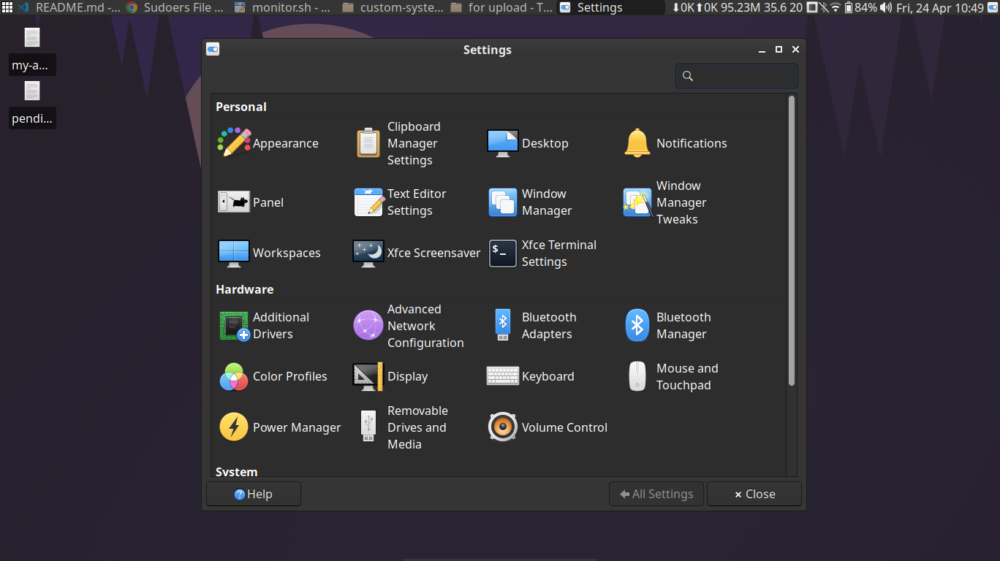
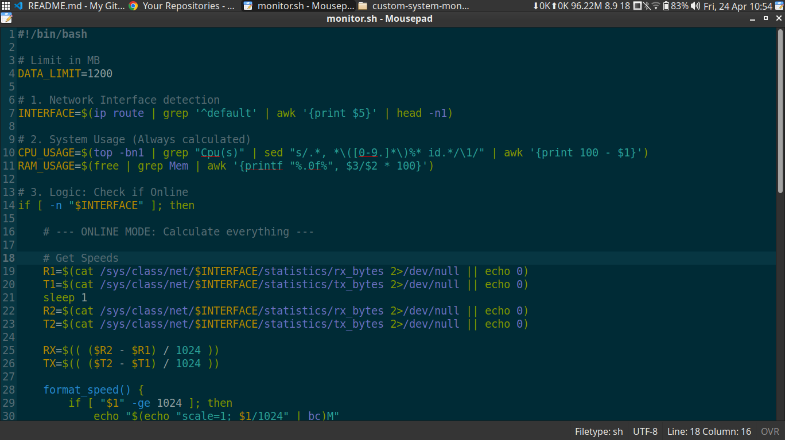
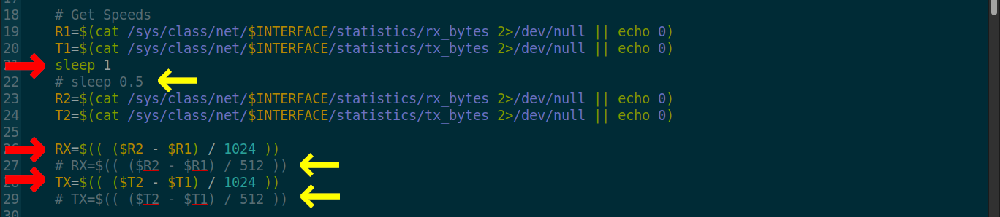

# ⚡ Custom System Monitor (XFCE Panel)

## 🧠 Background

*I recently transitioned **`from Windows 11 to Linux (Xubuntu)`** to better understand system-level behavior and gain more control over my environment.*

One of the things I appreciate most about Linux is its **flexibility** — but that flexibility also comes with a learning curve.

To move beyond theory, **I built this custom monitoring script to understand how system metrics and networking work under the hood.**

## 📑 Table of Contents

- **[Overview](#-overview)**
- **[Why I was inactive](#-why-i-was-inactive)**
- **[Xubuntu Setup Snapshot](#-xubuntu-setup-snapshot)**
- **[What I Made](#-what-i-made)**
- **[Challenges & Solutions](#️-challenges--solutions)**
- **[Why This Matters](#-why-this-matters)**
- **[How to use](#-how-to-use)**
- **[Preview (live monitoring output)](#-preview-live-monitoring-output)**
- **[Final Thoughts](#-final-thoughts)**

## 🧠 Overview

Since I wanted to understand the system deeply, I decided to build something useful for myself —

⚙️ **A Custom Resource Monitor**
* CPU Usage (%)
* RAM Usage (%)
* Internet Upload Speed
* Internet Download Speed
* Total Data Consumed (Daily)

This hands-on approach helped me understand the system much better.

## ⏳ Why I was inactive

I spent this time **exploring and getting comfortable with a new operating system** at a deeper level. To support that learning, I **built a custom monitoring script from scratch**.

Working in an **unfamiliar environment** without clarity on how things are structured or where components live can significantly **slow down** progress. Taking the time to understand these fundamentals helped me **build better intuition and work more efficiently** going forward.

## 📸 Xubuntu Setup Snapshot

Excited to keep learning and building more on Linux 🚀




## 📂 What I Made

### 1️⃣ monitor.sh

Main script responsible for collecting and displaying system metrics.



**Key Features:**

- Auto-detects active network interface  
- Calculates CPU and RAM usage in real time  
- Tracks upload/download speed using `/sys/class/net`  
- Handles **online vs offline modes gracefully**  
- Outputs formatted text for panel integration  

### 2️⃣ daily_data_alert.sh (now integrated into monitor.sh)

A background alert system for monitoring daily data usage.

**Key Features:**

- Checks total daily data usage via `vnstat`
- Converts units (GB → MB) safely
- Triggers notification when usage exceeds limit (default: 1000 MB)
- Triggers a **sound alert** using `paplay` when daily **data usage exceeds the defined threshold**
- Prevents duplicate alerts using a flag file

### Updated version:
- All in one single script
- Updated logic
- Faster execution
- Half the size of previous version

---

## ⚠️ Challenges & Solutions

While building this script, I **ran into several practical challenges** that pushed me to better understand how networking works under Linux.

### 🔍 Challenges:
- Displaying live network speed directly on the panel required additional research — the **Generic Monitor plugin handles the rendering**, not the script itself
- Detecting whether the system is actually connected to the internet was not straightforward
- Initially **relied on nethogs** for live speed tracking, but found it unreliable and inconsistent
- Accidentally used the wrong field while calculating daily data usage:
    ```
    vnstat .... -f11
    ```
- Sound notifications were not working due to conflicts with the XFCE sound manager

### ✅ Solutions
- Used **ip route** to reliably detect an active network interface
- Read raw byte data directly from **/sys/class/net/** for accurate real-time speed calculation
- Corrected data usage parsing by switching to:
    ```
    vnstat ..... -f6
    ```
- Replaced default audio handling with **paplay for consistent sound notifications**
- Integrated the script with **XFCE Generic Monitor for real-time panel updates**

## 💡 Why This Matters

In real-world environments, not every problem needs a full-scale monitoring stack. Knowing when to use a **lightweight, purpose-built solution** is just as important as knowing enterprise tools.

This project reflects a practical DevOps mindset — **focusing on efficiency, control, and reliability** while avoiding unnecessary complexity.

- Minimizes resource usage while still providing meaningful system insights
- Offers full control and customization at the script level
- Emphasizes automation and observability using native Linux capabilities
- Designed to be portable and easily adaptable across environments

**It reflects a core DevOps principle**: `build`, `lean`, `understand the system deeply`, and `scale only when required`.

## 🚀 How to use

#### 1. 🔧 Prerequisites:
Make sure the following are installed:
- XFCE Generic Monitor plugin
- vnstat
- `paplay` (from PulseAudio)

#### 2. 📥 Clone the repo
```
git clone https://github.com/sonuparit/custom-system-monitor.git
cd custom-system-monitor/
```
- move the monitor.sh script to home directory, to avoid permission errors

#### 3. 🔐 Make the script executable
```
chmod 700 monitor.sh
``` 

#### 4. 📊 Configure in Generic Monitor
- Use the script as input inside the Generic Monitor plugin

- Set update interval to 3 seconds (recommended for stability and low system load)

> [!NOTE]
> Avoid setting the update interval to 1 second — it can cause high CPU usage and may freeze the system.

**If you still want near real-time updates, you’ll need to adjust the script.**

- ⚙️ Settings for 1-Second Interval (**open the script**)
    - Comment out all sections marked with red arrows
    - Uncomment all sections marked with yellow arrows
    

#### 5. 🔄 Resetting the Notification State
- Add this command to system startup:
    ```
    rm /tmp/data_alert_*
    ```
- This removes the notification state file on startup, allowing alerts to trigger again for the new session.

## 📸 Preview (Live Monitoring Output)

#### Below is how the monitor behaves in different scenarios:

1. Online:
    

2. Offline:
    

3. Data Alert (Simulated with 10MB)
    

------------------------------------------------------------------------

## 🏁 Final Thoughts

This project goes beyond just building a script — **it reflects my approach to learning by doing.**

Instead of relying only on documentation, **I focused on building something practical**, which helped me understand Linux systems, networking, and observability at a deeper level.